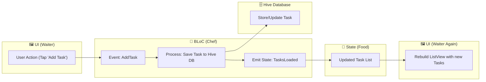

# 📝 Task Manager App  

A **Flutter** task management app built using the **BLoC Pattern 🧠** for predictable state management, **Hive** for local storage, and **local notifications** for task reminders.  

This app helps users organize daily tasks into collections, set reminders, and manage tasks efficiently with a clean, responsive UI.  

---
## 📛 Badges

### Built With


### State Management


### Database


### Code Style & License


---

## ⚡ Features  
- ✅ Add, edit, delete, and reorder tasks  
- 📂 Organize tasks into **collections**  
- 🎨 Switch between **light & dark themes**  
- ⏰ Schedule task **reminders** using notifications  
- 🧠 **BLoC pattern** for clean and testable state management  
- 🛠️ Persistent storage using **Hive database**  

---

## 🏗️ Core Architecture: BLoC Pattern  

The app is built using the **BLoC (Business Logic Component) pattern**, which ensures a **clear and predictable flow of data**.  

Think of it like a **restaurant kitchen**:  

- **UI (Waiter):** Collects user requests (Events), e.g., tapping "Add Task"  
- **BLoC (Chef):** Processes the event, updates the database, prepares new state  
- **State (Food):** The finished data returned to UI  
- **UI (Waiter Again):** Displays the updated data to the user  

**Flow:**  


---

## 🧩 Architecture Diagram  



# 📂 Project Structure

```
lib/
│── main.dart                 # Entry point: initializes Hive, Notifications, provides BLoCs
│
├── bloc/                     # State management logic
│   ├── collection_bloc/       # Add/Delete collections
│   │    ├── collection_bloc.dart
│   │    ├── collection_event.dart
│   │    └── collection_state.dart
│   ├── task_bloc/             # Add/Edit/Delete/Complete/Reorder tasks
│   │    ├── tasks_bloc.dart
│   │    ├── tasks_event.dart
│   │    └── tasks_state.dart
│   └── theme_bloc/            # Manage light/dark theme
│        ├── theme_bloc.dart
│        ├── theme_event.dart
│        └── theme_state.dart
│
├── data/
│   └── theme_repository.dart  # Read/Write theme preference (SharedPreferences)
│
├── models/                   # Data blueprints
│   ├── collection.dart        # Collection model (id, name)
│   └── task.dart              # Task model (id, title, collectionId, status, reminderTime)
│
├── services/
│   └── notification_service.dart  # Local notifications setup & scheduling
│
├── screens/
│   ├── home_screen.dart       # Dashboard with all collections
│   ├── task_screen.dart       # Task list for a collection
│   └── app_theme.dart         # Light/Dark theme styles
│
└── widgets/
    └── app_drawer.dart        # Navigation drawer (Home, General, Collections)

```

# 🚀 Getting Started
```
# Clone the repository
git clone https://github.com/your-username/task-manager.git

# Navigate into project
cd task-manager

# Install dependencies
flutter pub get

# Run the app
flutter run

```
## 📌 Roadmap

* 🔔 Push notifications via Firebase
* ☁️ Cloud sync for tasks & collections
* 🧩 Drag-and-drop task reordering across collections

## 🤝 Contributing

Contributions are welcome! Please open an issue or submit a PR.

## 🛡️ License

This project is licensed under the [MIT License](https://opensource.org/licenses/MIT) – see the [LICENSE file](./LICENSE) for details.
